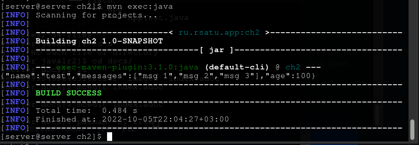
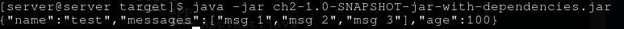
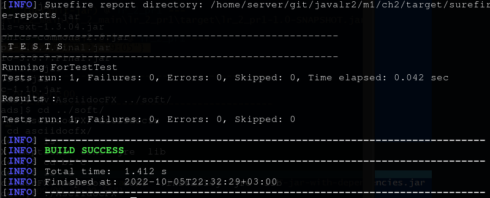

= Отчет по лабораторной работе 2
:listing-caption: Листинг
:figure-caption: Рис
:source-highlighter: coderay

Студент: Беляев Максим

Группа: ПИМ-22

== 1. Постановка задачи

. Создать несколько maven-проектов:
- Родительский
- 2 Дочерних (1 дочерний проект зависит от второго)
. Подключить внешнюю зависимость (из глобального репозитория) в один из проектов и продемонстрировать работу этой зависимости.
. Создать maven-проект, который будет помещен в локальный репозиторий. Добавить этот проект как зависимость в проект из п.1
. Создать maven-проект, упаковать его в jar-with-dependencies, продемонстрировать рабту jar. Запустить проект с помощью maven.
. Выполнить тест подключенной зависимости из п.2 с помощью junit 

== 2. Разработка задачи

=== 2.1 Структура проекта

Проект разделен на следующие директории:

dep:: Проект-зависимость, размещенная в локальном репозитории
m1:: Проект-родитель, содержащий проекты ch1 и ch2
m1/ch1::: Дочерный проект
m1/ch2::: Дочерний проект, собираемый в jar-with-dependencies, в котором происхродило тестирование
docs:: Данная документация

== 3. Информация о реализации

=== 3.1 Задание 1

Для выполнения первого задания были созданы родительский проект m1 и два дочерних проекта ch1 и ch2, где ch2 зависит от ch1

.Родительский файл pom.xml
[source,xml]
----
<?xml version="1.0" encoding="UTF-8" standalone="no"?>
<project xmlns="http://maven.apache.org/POM/4.0.0" xmlns:xsi="http://www.w3.org/2001/XMLSchema-instance" xsi:schemaLocation="http://maven.apache.org/POM/4.0.0 http://maven.apache.org/maven-v4_0_0.xsd">
  <modelVersion>4.0.0</modelVersion>
  <groupId>ru.rsatu.app</groupId>
  <artifactId>m1</artifactId>
  <packaging>pom</packaging>
  <version>1.0-SNAPSHOT</version>
  <name>m1</name>
  <url>http://maven.apache.org</url>
  <dependencies>
    <dependency>
      <groupId>junit</groupId>
      <artifactId>junit</artifactId>
      <version>3.8.1</version>
      <scope>test</scope>
    </dependency>
  </dependencies>
  <modules>
        <module>ch1</module>
        <module>ch2</module>
  </modules>
</project>

----

.Файл pom.xml дочернего проекта ch1
[source,xml]
----
<?xml version="1.0"?>
<project xsi:schemaLocation="http://maven.apache.org/POM/4.0.0 https://maven.apache.org/xsd/maven-4.0.0.xsd" xmlns="http://maven.apache.org/POM/4.0.0"
    xmlns:xsi="http://www.w3.org/2001/XMLSchema-instance">
  <modelVersion>4.0.0</modelVersion>
  <parent>
    <groupId>ru.rsatu.app</groupId>
    <artifactId>m1</artifactId>
    <version>1.0-SNAPSHOT</version>
  </parent>
  <groupId>ru.rsatu.app</groupId>
  <artifactId>ch1</artifactId>
  <version>1.0-SNAPSHOT</version>
  <name>ch1</name>
  <url>http://maven.apache.org</url>
  <dependencies>
    <dependency>
      <groupId>junit</groupId>
      <artifactId>junit</artifactId>
      <version>3.8.1</version>
      <scope>test</scope>
    </dependency>
  </dependencies>
</project>

----

.Файл pom.xml дочернего проекта ch2, зависящего от ch1
[source,xml]
----
<?xml version="1.0"?>
<project xsi:schemaLocation="http://maven.apache.org/POM/4.0.0 https://maven.apache.org/xsd/maven-4.0.0.xsd" xmlns="http://maven.apache.org/POM/4.0.0"
    xmlns:xsi="http://www.w3.org/2001/XMLSchema-instance">
  <modelVersion>4.0.0</modelVersion>
  <parent>
    <groupId>ru.rsatu.app</groupId>
    <artifactId>m1</artifactId>
    <version>1.0-SNAPSHOT</version>
  </parent>
  <groupId>ru.rsatu.app</groupId>
  <artifactId>ch2</artifactId>
  <version>1.0-SNAPSHOT</version>
  <name>ch2</name>
  <url>http://maven.apache.org</url>
  <dependencies>
    <dependency>
      <groupId>ru.rsatu.app</groupId>
      <artifactId>ch1</artifactId>
      <version>1.0-SNAPSHOT</version>
    </dependency>
  </dependencies>
</project>
----

=== 3.2 Задание 2

Для выполнени задания 2, добавим в дочерний проект ch2 библиотеку json-simple

.Изменения в pom.xml
[source,xml]
----
<dependencies>
    <dependency>
      <groupId>ru.rsatu.app</groupId>
      <artifactId>ch1</artifactId>
      <version>1.0-SNAPSHOT</version>
    </dependency>
    <dependency>
        <groupId>com.googlecode.json-simple</groupId>
        <artifactId>json-simple</artifactId>
        <version>1.1.1</version>
    </dependency>
  </dependencies>

----

.Класс App
[source,java]
----
package ru.rsatu.app;

import org.json.simple.JSONArray;
import org.json.simple.JSONObject;

import java.io.FileWriter;
import java.io.IOException;

public class App {

    public static void main( String[] args ) {

        JSONObject obj = new JSONObject();
        obj.put("name", "test");
        obj.put("age", 100);

        JSONArray list = new JSONArray();
        list.add("msg 1");
        list.add("msg 2");
        list.add("msg 3");

        obj.put("messages", list);

        System.out.println(obj);
    }
}
----

Для запуска и выполнения класса была использована следующая команда.

.Команда для запуска проекта ch2
[source,shell]
----
mvn compile exec:java -Dexec.mainClass="ru.rsatu.app.App" -e
----

.Результат выполнения
[source,json]
----
{"name":"test","messages":["msg 1","msg 2","msg 3"],"age":100}
----

=== 3.3 Задание 3

Для выполнения третьего задания был создан проект dep, содержащий класс Dep

.Файл pom.xml проекта dep
[source,xml]
----
<project xmlns="http://maven.apache.org/POM/4.0.0" xmlns:xsi="http://www.w3.org/2001/XMLSchema-instance"
  xsi:schemaLocation="http://maven.apache.org/POM/4.0.0 http://maven.apache.org/maven-v4_0_0.xsd">
  <modelVersion>4.0.0</modelVersion>
  <groupId>ru.rsatu.dep</groupId>
  <artifactId>dep</artifactId>
  <packaging>jar</packaging>
  <version>1.0-SNAPSHOT</version>
  <name>dep</name>
  <url>http://maven.apache.org</url>
  <dependencies>
    <dependency>
      <groupId>junit</groupId>
      <artifactId>junit</artifactId>
      <version>3.8.1</version>
      <scope>test</scope>
    </dependency>
  </dependencies>
</project>
----

.Код класса Dep
[source,java]
----
package ru.rsatu.dep;

public class Dep {
    public static String getString() {
        return "Hi, im dependency";
    }
}
----

Этот проект был собран и добавлен в локальный репозиторий следующей командой.

.Команда сборки проекта
----
mvn install
----

После этого проект dep был добавлен в зависимости к проекту ch2

.Измененая часть pom.xml проекта ch2
[source,xml]
----
<dependencies>
    <dependency>
      <groupId>ru.rsatu.app</groupId>
      <artifactId>ch1</artifactId>
      <version>1.0-SNAPSHOT</version>
    </dependency>
    <dependency>
        <groupId>ru.rsatu.dep</groupId>
        <artifactId>dep</artifactId>
        <version>1.0-SNAPSHOT</version>
    </dependency>
    <dependency>
        <groupId>com.googlecode.json-simple</groupId>
        <artifactId>json-simple</artifactId>
        <version>1.1.1</version>
    </dependency>
  </dependencies>
----

=== 3.4 Задание 4

Модифицируем проект ch2, для того чтобы собрать его как jar-with-dependencies

.Измененный файл pom.xml проекта ch2
[source,xml]
----
<?xml version="1.0"?>
<project xsi:schemaLocation="http://maven.apache.org/POM/4.0.0 https://maven.apache.org/xsd/maven-4.0.0.xsd" xmlns="http://maven.apache.org/POM/4.0.0"
    xmlns:xsi="http://www.w3.org/2001/XMLSchema-instance">
  <modelVersion>4.0.0</modelVersion>
  <parent>
    <groupId>ru.rsatu.app</groupId>
    <artifactId>m1</artifactId>
    <version>1.0-SNAPSHOT</version>
  </parent>
  <groupId>ru.rsatu.app</groupId>
  <artifactId>ch2</artifactId>
  <version>1.0-SNAPSHOT</version>
  <name>ch2</name>
  <url>http://maven.apache.org</url>
  <dependencies>
    <dependency>
      <groupId>ru.rsatu.app</groupId>
      <artifactId>ch1</artifactId>
      <version>1.0-SNAPSHOT</version>
    </dependency>
    <dependency>
        <groupId>ru.rsatu.dep</groupId>
        <artifactId>dep</artifactId>
        <version>1.0-SNAPSHOT</version>
    </dependency>
    <dependency>
        <groupId>com.googlecode.json-simple</groupId>
        <artifactId>json-simple</artifactId>
        <version>1.1.1</version>
    </dependency>
  </dependencies>

    <properties>
        <exec.mainClass>ru.rsatu.app.App</exec.mainClass>
    </properties>

    <build>
        <sourceDirectory>src</sourceDirectory>
        <plugins>
            <plugin>
                <groupId>org.apache.maven.plugins</groupId>
                <artifactId>maven-compiler-plugin</artifactId>
                <version>3.8.1</version>
                <configuration>
                    <source>1.8</source>
                    <target>1.8</target>
                </configuration>
            </plugin>
            <plugin>
                <artifactId>maven-assembly-plugin</artifactId>
                <configuration>
                    <archive>
                        <manifest>
                            <mainClass>ru.rsatu.app.App</mainClass>
                        </manifest>
                    </archive>
                    <descriptorRefs>
                        <descriptorRef>jar-with-dependencies</descriptorRef>
                    </descriptorRefs>
                </configuration>
            </plugin>
        </plugins>
    </build>
  
</project>
----

Для сборки и запуска были использованы следующие команды:

.Сборка и запуск
[source,shell]
----
mvn clean
mvn package assembly:single
mvn exec:java
----

.Результаты выполнения
[source,json]
----
{"name":"test","messages":["msg 1","msg 2","msg 3"],"age":100}
----

=== 3.5 Задание 5

Для тестирования библиотеки добавленной в п. 3.2 добавим в проект ch2 библиотеку junit

.Изменения в pom.xml
[source,xml]
----
  <dependencies>
    <dependency>
      <groupId>ru.rsatu.app</groupId>
      <artifactId>ch1</artifactId>
      <version>1.0-SNAPSHOT</version>
    </dependency>
    <dependency>
        <groupId>ru.rsatu.dep</groupId>
        <artifactId>dep</artifactId>
        <version>1.0-SNAPSHOT</version>
    </dependency>
    <dependency>
        <groupId>com.googlecode.json-simple</groupId>
        <artifactId>json-simple</artifactId>
        <version>1.1.1</version>
    </dependency>
    <dependency>
        <groupId>junit</groupId>
        <artifactId>junit</artifactId>
        <version>4.13.2</version>
    </dependency>
  </dependencies>
----

Далее был создан класс ForTest в котором находились тестируемые функции

.Код класса ForTest
[source,java]
----
package ru.rsatu.app;

import org.json.simple.parser.JSONParser;
import org.json.simple.JSONObject;

public class ForTest {

    public static JSONObject stringToJson(String arg) {
        try {
            JSONParser parser = new JSONParser();
            JSONObject json = (JSONObject) parser.parse(arg);
            return json;
        } catch (Exception e) {
            return null;
        }
    }

    public static String jsonToString(JSONObject arg) {
        return arg.toString();
    }
}
----

А так же был создан класс ForTestTest, содержащий тесты

.Код класса ForTestTest
[source,java]
----
import org.junit.Assert;
import org.junit.Test;
import ru.rsatu.app.ForTest;
import ru.rsatu.dep.Dep;

public class ForTestTest {
    @Test
    public void testJson() {
        String input = "{\"name\":\""+Dep.getString()+"\"}";
        String result = "{\"name\":\"Hi, im dependency\"}";
        Assert.assertEquals(result, 
        ForTest.jsonToString(ForTest.stringToJson(input)));
    }
}
----

Затем было проведено успешное тестирование с помощью команды

.Команда запуска тестирования
----
mvn test
----

== 4. Результаты выполнения

В результате выполнения лабораторной работы были получены следующие проекты:

* dep - проект-зависимость, размещенная в локальном репозитории
* m1 - проект-родитель, содержащий проекты ch1 и ch2
- ch1 - дочерный проект
- ch2 - дочерний проект, собираемый в jar-with-dependencies, в котором происхродило тестирование, имеющий следующие зависимости:
** dep
** ch1
** json-simple
** junit

.Результат запуска ch2 через maven

.Результат запуска ch2 в виде jar-with-dependencies

.Результаты тестирования

== 5. Вывод

В результате выполнения лабораторной работы получены навыки по работе с maven, созданию вложенных проектов с зависимостями, их тестирование и сборка в jar-with-dependencies, а так же размещение проектов в локальном репозитории.
